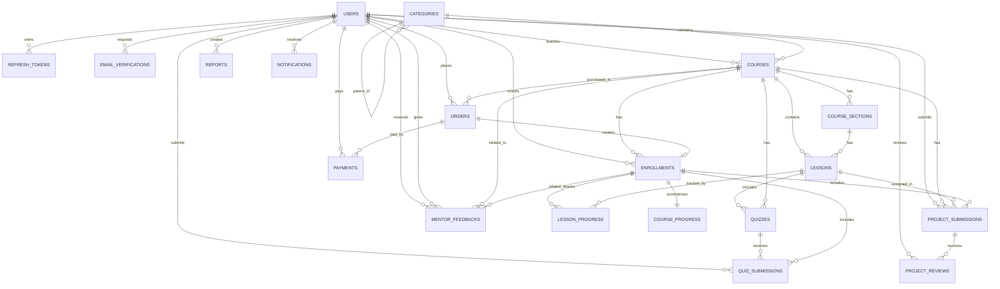

# Tài liệu thiết kế Database - Hệ thống E-learning / LMS

## 1. Tổng quan hệ thống (Overview)

Tài liệu này mô tả thiết kế cơ sở dữ liệu cho hệ thống **E-learning / LMS (Learning Management System)**. Database được thiết kế để hỗ trợ các nghiệp vụ chính sau:

- Quản lý người dùng, xác thực, phân quyền và phiên đăng nhập.
- Quản lý danh mục, khóa học, chương học và bài học.
- Quản lý đăng ký khóa học, tiến độ học tập theo bài học và toàn khóa học.
- Quản lý bài kiểm tra, bài nộp dự án và kết quả đánh giá.
- Quản lý phản hồi giữa mentor/giảng viên và học viên.
- Quản lý đơn hàng, thanh toán và giao dịch mua khóa học.
- Quản lý báo cáo vi phạm và thông báo hệ thống.

Thiết kế này ưu tiên tính mở rộng, tính toàn vẹn dữ liệu, khả năng truy vấn nhanh và phù hợp với mô hình backend REST API hoặc GraphQL. Kiểu dữ liệu được định hướng theo **PostgreSQL** với khóa chính dạng `UUID`. Nếu sử dụng MySQL, có thể thay `UUID` bằng `CHAR(36)` hoặc `BIGINT AUTO_INCREMENT` tùy chuẩn dự án.

> Ghi chú: Danh sách bảng hiện tại chưa có bảng `order_items`, vì vậy thiết kế giả định mỗi `orders` gắn với một khóa học (`course_id`). Nếu hệ thống cần giỏ hàng hoặc một đơn hàng chứa nhiều khóa học, nên bổ sung bảng `order_items`.

---

## 2. Sơ đồ thực thể (ERD)

---

## 3. Thiết kế chi tiết từng bảng

## 3.1. Module Người dùng & Xác thực (User & Auth)

### 3.1.1. Table: `users`

Lưu thông tin tài khoản người dùng trong hệ thống, bao gồm admin, giảng viên/mentor và học viên.

| Field | Data Type | Constraints | Description |
|---|---|---|---|
| id | UUID | PK, DEFAULT gen_random_uuid() | Mã định danh duy nhất của người dùng. |
| full_name | VARCHAR(150) | NOT NULL | Họ và tên người dùng. |
| email | VARCHAR(255) | NOT NULL, UNIQUE | Email đăng nhập, không được trùng. |
| password_hash | VARCHAR(255) | NOT NULL | Mật khẩu đã được mã hóa bằng bcrypt/argon2. |
| phone | VARCHAR(20) | NULL, UNIQUE | Số điện thoại người dùng, có thể dùng cho xác minh sau này. |
| avatar_url | TEXT | NULL | Đường dẫn ảnh đại diện. |
| role | VARCHAR(30) | NOT NULL, DEFAULT 'student' | Vai trò: `admin`, `instructor`, `mentor`, `student`. |
| status | VARCHAR(30) | NOT NULL, DEFAULT 'active' | Trạng thái tài khoản: `active`, `inactive`, `banned`, `pending`. |
| email_verified_at | TIMESTAMP | NULL | Thời điểm email được xác minh. |
| last_login_at | TIMESTAMP | NULL | Thời điểm đăng nhập gần nhất. |
| created_at | TIMESTAMP | NOT NULL, DEFAULT CURRENT_TIMESTAMP | Thời điểm tạo tài khoản. |
| updated_at | TIMESTAMP | NOT NULL, DEFAULT CURRENT_TIMESTAMP | Thời điểm cập nhật tài khoản gần nhất. |
| deleted_at | TIMESTAMP | NULL | Thời điểm xóa mềm tài khoản, nếu có. |

---

### 3.1.2. Table: `refresh_tokens`

Lưu refresh token dùng để cấp lại access token mà không yêu cầu người dùng đăng nhập lại.

| Field | Data Type | Constraints | Description |
|---|---|---|---|
| id | UUID | PK, DEFAULT gen_random_uuid() | Mã định danh refresh token. |
| user_id | UUID | FK -> users(id), NOT NULL | Người dùng sở hữu token. |
| token_hash | VARCHAR(255) | NOT NULL, UNIQUE | Refresh token đã được hash, không lưu token gốc. |
| device_info | TEXT | NULL | Thông tin thiết bị hoặc trình duyệt đăng nhập. |
| ip_address | VARCHAR(45) | NULL | Địa chỉ IP khi tạo token, hỗ trợ IPv4/IPv6. |
| expires_at | TIMESTAMP | NOT NULL | Thời điểm hết hạn token. |
| revoked_at | TIMESTAMP | NULL | Thời điểm token bị thu hồi. |
| created_at | TIMESTAMP | NOT NULL, DEFAULT CURRENT_TIMESTAMP | Thời điểm tạo token. |

---

### 3.1.3. Table: `email_verifications`

Lưu thông tin xác minh email, đặt lại mật khẩu hoặc các yêu cầu xác thực qua email.

| Field | Data Type | Constraints | Description |
|---|---|---|---|
| id | UUID | PK, DEFAULT gen_random_uuid() | Mã định danh yêu cầu xác minh. |
| user_id | UUID | FK -> users(id), NULL | Người dùng liên quan, có thể NULL trong trường hợp đăng ký chưa hoàn tất. |
| email | VARCHAR(255) | NOT NULL | Email cần xác minh. |
| token_hash | VARCHAR(255) | NOT NULL, UNIQUE | Token/OTP đã hash dùng để xác minh. |
| purpose | VARCHAR(50) | NOT NULL | Mục đích: `verify_email`, `reset_password`, `change_email`. |
| expires_at | TIMESTAMP | NOT NULL | Thời điểm hết hạn mã xác minh. |
| verified_at | TIMESTAMP | NULL | Thời điểm xác minh thành công. |
| created_at | TIMESTAMP | NOT NULL, DEFAULT CURRENT_TIMESTAMP | Thời điểm tạo yêu cầu xác minh. |

---

## 3.2. Module Khóa học & Nội dung (Courses & Content)

### 3.2.1. Table: `categories`

Lưu danh mục khóa học. Bảng này hỗ trợ danh mục cha - con thông qua `parent_id`.

| Field | Data Type | Constraints | Description |
|---|---|---|---|
| id | UUID | PK, DEFAULT gen_random_uuid() | Mã định danh danh mục. |
| parent_id | UUID | FK -> categories(id), NULL | Danh mục cha, dùng cho phân cấp danh mục. |
| name | VARCHAR(150) | NOT NULL | Tên danh mục. |
| slug | VARCHAR(180) | NOT NULL, UNIQUE | Chuỗi URL thân thiện, ví dụ `web-development`. |
| description | TEXT | NULL | Mô tả danh mục. |
| icon_url | TEXT | NULL | Đường dẫn icon hoặc ảnh đại diện danh mục. |
| sort_order | INT | NOT NULL, DEFAULT 0 | Thứ tự hiển thị danh mục. |
| is_active | BOOLEAN | NOT NULL, DEFAULT TRUE | Trạng thái hiển thị của danh mục. |
| created_at | TIMESTAMP | NOT NULL, DEFAULT CURRENT_TIMESTAMP | Thời điểm tạo danh mục. |
| updated_at | TIMESTAMP | NOT NULL, DEFAULT CURRENT_TIMESTAMP | Thời điểm cập nhật danh mục. |

---

### 3.2.2. Table: `courses`

Lưu thông tin khóa học, bao gồm giảng viên, danh mục, giá bán và trạng thái xuất bản.

| Field | Data Type | Constraints | Description |
|---|---|---|---|
| id | UUID | PK, DEFAULT gen_random_uuid() | Mã định danh khóa học. |
| category_id | UUID | FK -> categories(id), NOT NULL | Danh mục của khóa học. |
| instructor_id | UUID | FK -> users(id), NOT NULL | Người tạo/giảng viên phụ trách khóa học. |
| title | VARCHAR(255) | NOT NULL | Tên khóa học. |
| slug | VARCHAR(280) | NOT NULL, UNIQUE | Chuỗi URL thân thiện của khóa học. |
| short_description | VARCHAR(500) | NULL | Mô tả ngắn hiển thị trên danh sách khóa học. |
| description | TEXT | NULL | Mô tả chi tiết khóa học. |
| thumbnail_url | TEXT | NULL | Ảnh đại diện khóa học. |
| level | VARCHAR(30) | NOT NULL, DEFAULT 'beginner' | Cấp độ: `beginner`, `intermediate`, `advanced`. |
| language | VARCHAR(20) | NOT NULL, DEFAULT 'vi' | Ngôn ngữ chính của khóa học. |
| price | DECIMAL(12,2) | NOT NULL, DEFAULT 0 | Giá gốc của khóa học. |
| discount_price | DECIMAL(12,2) | NULL | Giá khuyến mãi, nếu có. |
| status | VARCHAR(30) | NOT NULL, DEFAULT 'draft' | Trạng thái: `draft`, `pending_review`, `published`, `archived`. |
| total_duration_minutes | INT | NOT NULL, DEFAULT 0 | Tổng thời lượng học tính theo phút. |
| published_at | TIMESTAMP | NULL | Thời điểm khóa học được xuất bản. |
| created_at | TIMESTAMP | NOT NULL, DEFAULT CURRENT_TIMESTAMP | Thời điểm tạo khóa học. |
| updated_at | TIMESTAMP | NOT NULL, DEFAULT CURRENT_TIMESTAMP | Thời điểm cập nhật khóa học. |
| deleted_at | TIMESTAMP | NULL | Thời điểm xóa mềm khóa học. |

---

### 3.2.3. Table: `course_sections`

Lưu các chương/phần trong một khóa học.

| Field | Data Type | Constraints | Description |
|---|---|---|---|
| id | UUID | PK, DEFAULT gen_random_uuid() | Mã định danh chương học. |
| course_id | UUID | FK -> courses(id), NOT NULL | Khóa học chứa chương này. |
| title | VARCHAR(255) | NOT NULL | Tên chương/phần học. |
| description | TEXT | NULL | Mô tả ngắn về chương học. |
| position | INT | NOT NULL, DEFAULT 0 | Thứ tự hiển thị trong khóa học. |
| is_published | BOOLEAN | NOT NULL, DEFAULT TRUE | Chương học có được hiển thị hay không. |
| created_at | TIMESTAMP | NOT NULL, DEFAULT CURRENT_TIMESTAMP | Thời điểm tạo chương học. |
| updated_at | TIMESTAMP | NOT NULL, DEFAULT CURRENT_TIMESTAMP | Thời điểm cập nhật chương học. |

---

### 3.2.4. Table: `lessons`

Lưu thông tin bài học thuộc một chương và khóa học.

| Field | Data Type | Constraints | Description |
|---|---|---|---|
| id | UUID | PK, DEFAULT gen_random_uuid() | Mã định danh bài học. |
| course_id | UUID | FK -> courses(id), NOT NULL | Khóa học chứa bài học. |
| section_id | UUID | FK -> course_sections(id), NOT NULL | Chương chứa bài học. |
| title | VARCHAR(255) | NOT NULL | Tên bài học. |
| lesson_type | VARCHAR(30) | NOT NULL, DEFAULT 'video' | Loại bài học: `video`, `text`, `quiz`, `project`, `file`. |
| content | TEXT | NULL | Nội dung dạng text/HTML/Markdown của bài học. |
| video_url | TEXT | NULL | Đường dẫn video bài học. |
| file_url | TEXT | NULL | Tài liệu đính kèm của bài học. |
| duration_minutes | INT | NOT NULL, DEFAULT 0 | Thời lượng bài học tính theo phút. |
| position | INT | NOT NULL, DEFAULT 0 | Thứ tự bài học trong chương. |
| is_free_preview | BOOLEAN | NOT NULL, DEFAULT FALSE | Cho phép xem thử miễn phí hay không. |
| is_published | BOOLEAN | NOT NULL, DEFAULT TRUE | Trạng thái hiển thị của bài học. |
| created_at | TIMESTAMP | NOT NULL, DEFAULT CURRENT_TIMESTAMP | Thời điểm tạo bài học. |
| updated_at | TIMESTAMP | NOT NULL, DEFAULT CURRENT_TIMESTAMP | Thời điểm cập nhật bài học. |

---

## 3.3. Module Tiến độ & Học tập (Progress & Learning)

### 3.3.1. Table: `enrollments`

Lưu thông tin học viên đăng ký hoặc được cấp quyền học một khóa học.

| Field | Data Type | Constraints | Description |
|---|---|---|---|
| id | UUID | PK, DEFAULT gen_random_uuid() | Mã định danh lượt đăng ký khóa học. |
| user_id | UUID | FK -> users(id), NOT NULL | Học viên đăng ký khóa học. |
| course_id | UUID | FK -> courses(id), NOT NULL | Khóa học được đăng ký. |
| order_id | UUID | FK -> orders(id), NULL | Đơn hàng tạo ra quyền học, NULL nếu được admin cấp thủ công. |
| status | VARCHAR(30) | NOT NULL, DEFAULT 'active' | Trạng thái: `active`, `completed`, `cancelled`, `expired`. |
| enrolled_at | TIMESTAMP | NOT NULL, DEFAULT CURRENT_TIMESTAMP | Thời điểm bắt đầu học. |
| completed_at | TIMESTAMP | NULL | Thời điểm hoàn thành khóa học. |
| expires_at | TIMESTAMP | NULL | Thời điểm hết hạn quyền truy cập, nếu có. |
| created_at | TIMESTAMP | NOT NULL, DEFAULT CURRENT_TIMESTAMP | Thời điểm tạo bản ghi. |
| updated_at | TIMESTAMP | NOT NULL, DEFAULT CURRENT_TIMESTAMP | Thời điểm cập nhật bản ghi. |

**Ràng buộc đề xuất:** `UNIQUE(user_id, course_id)` để tránh một học viên đăng ký trùng một khóa học.

---

### 3.3.2. Table: `lesson_progress`

Theo dõi tiến độ học của từng học viên trên từng bài học.

| Field | Data Type | Constraints | Description |
|---|---|---|---|
| id | UUID | PK, DEFAULT gen_random_uuid() | Mã định danh tiến độ bài học. |
| enrollment_id | UUID | FK -> enrollments(id), NOT NULL | Lượt đăng ký khóa học tương ứng. |
| user_id | UUID | FK -> users(id), NOT NULL | Học viên đang học bài này. |
| lesson_id | UUID | FK -> lessons(id), NOT NULL | Bài học được theo dõi tiến độ. |
| status | VARCHAR(30) | NOT NULL, DEFAULT 'not_started' | Trạng thái: `not_started`, `in_progress`, `completed`. |
| progress_percent | DECIMAL(5,2) | NOT NULL, DEFAULT 0 | Phần trăm hoàn thành bài học. |
| watched_seconds | INT | NOT NULL, DEFAULT 0 | Số giây video đã xem, nếu là bài video. |
| last_accessed_at | TIMESTAMP | NULL | Lần truy cập bài học gần nhất. |
| completed_at | TIMESTAMP | NULL | Thời điểm hoàn thành bài học. |
| created_at | TIMESTAMP | NOT NULL, DEFAULT CURRENT_TIMESTAMP | Thời điểm tạo tiến độ. |
| updated_at | TIMESTAMP | NOT NULL, DEFAULT CURRENT_TIMESTAMP | Thời điểm cập nhật tiến độ. |

**Ràng buộc đề xuất:** `UNIQUE(enrollment_id, lesson_id)` để mỗi lượt đăng ký chỉ có một tiến độ cho mỗi bài học.

---

### 3.3.3. Table: `course_progress`

Tổng hợp tiến độ học tập của học viên trong toàn bộ khóa học.

| Field | Data Type | Constraints | Description |
|---|---|---|---|
| id | UUID | PK, DEFAULT gen_random_uuid() | Mã định danh tiến độ khóa học. |
| enrollment_id | UUID | FK -> enrollments(id), NOT NULL, UNIQUE | Lượt đăng ký tương ứng. |
| user_id | UUID | FK -> users(id), NOT NULL | Học viên. |
| course_id | UUID | FK -> courses(id), NOT NULL | Khóa học. |
| completed_lessons_count | INT | NOT NULL, DEFAULT 0 | Số bài học đã hoàn thành. |
| total_lessons_count | INT | NOT NULL, DEFAULT 0 | Tổng số bài học trong khóa tại thời điểm tính tiến độ. |
| progress_percent | DECIMAL(5,2) | NOT NULL, DEFAULT 0 | Phần trăm hoàn thành khóa học. |
| last_lesson_id | UUID | FK -> lessons(id), NULL | Bài học gần nhất học viên truy cập. |
| status | VARCHAR(30) | NOT NULL, DEFAULT 'in_progress' | Trạng thái: `in_progress`, `completed`. |
| completed_at | TIMESTAMP | NULL | Thời điểm hoàn thành khóa học. |
| updated_at | TIMESTAMP | NOT NULL, DEFAULT CURRENT_TIMESTAMP | Thời điểm cập nhật tiến độ. |

---

## 3.4. Module Kiểm tra & Dự án (Assessment)

### 3.4.1. Table: `quizzes`

Lưu thông tin bài kiểm tra, có thể gắn với khóa học hoặc một bài học cụ thể.

| Field | Data Type | Constraints | Description |
|---|---|---|---|
| id | UUID | PK, DEFAULT gen_random_uuid() | Mã định danh bài kiểm tra. |
| course_id | UUID | FK -> courses(id), NOT NULL | Khóa học chứa quiz. |
| lesson_id | UUID | FK -> lessons(id), NULL | Bài học chứa quiz, NULL nếu quiz thuộc cấp khóa học. |
| title | VARCHAR(255) | NOT NULL | Tên bài kiểm tra. |
| description | TEXT | NULL | Mô tả bài kiểm tra. |
| questions | JSONB | NOT NULL | Danh sách câu hỏi, đáp án và cấu hình điểm. |
| passing_score | DECIMAL(5,2) | NOT NULL, DEFAULT 0 | Điểm tối thiểu để đạt. |
| time_limit_minutes | INT | NULL | Thời gian làm bài tính theo phút. |
| max_attempts | INT | NOT NULL, DEFAULT 1 | Số lần làm bài tối đa. |
| is_published | BOOLEAN | NOT NULL, DEFAULT FALSE | Trạng thái hiển thị quiz. |
| created_at | TIMESTAMP | NOT NULL, DEFAULT CURRENT_TIMESTAMP | Thời điểm tạo quiz. |
| updated_at | TIMESTAMP | NOT NULL, DEFAULT CURRENT_TIMESTAMP | Thời điểm cập nhật quiz. |

---

### 3.4.2. Table: `quiz_submissions`

Lưu kết quả làm bài quiz của học viên.

| Field | Data Type | Constraints | Description |
|---|---|---|---|
| id | UUID | PK, DEFAULT gen_random_uuid() | Mã định danh bài nộp quiz. |
| quiz_id | UUID | FK -> quizzes(id), NOT NULL | Quiz được nộp. |
| user_id | UUID | FK -> users(id), NOT NULL | Học viên làm bài. |
| enrollment_id | UUID | FK -> enrollments(id), NOT NULL | Lượt đăng ký khóa học liên quan. |
| answers | JSONB | NOT NULL | Câu trả lời của học viên. |
| score | DECIMAL(5,2) | NOT NULL, DEFAULT 0 | Điểm đạt được. |
| passed | BOOLEAN | NOT NULL, DEFAULT FALSE | Kết quả đạt hay không đạt. |
| attempt_no | INT | NOT NULL, DEFAULT 1 | Lần làm bài thứ mấy. |
| started_at | TIMESTAMP | NULL | Thời điểm bắt đầu làm bài. |
| submitted_at | TIMESTAMP | NOT NULL, DEFAULT CURRENT_TIMESTAMP | Thời điểm nộp bài. |
| time_spent_seconds | INT | NULL | Tổng thời gian làm bài tính bằng giây. |

**Ràng buộc đề xuất:** `UNIQUE(quiz_id, user_id, attempt_no)` để tránh trùng số lần làm bài.

---

### 3.4.3. Table: `project_submissions`

Lưu bài nộp dự án/bài tập thực hành của học viên.

| Field | Data Type | Constraints | Description |
|---|---|---|---|
| id | UUID | PK, DEFAULT gen_random_uuid() | Mã định danh bài nộp dự án. |
| course_id | UUID | FK -> courses(id), NOT NULL | Khóa học chứa dự án. |
| lesson_id | UUID | FK -> lessons(id), NULL | Bài học giao dự án, nếu có. |
| enrollment_id | UUID | FK -> enrollments(id), NOT NULL | Lượt đăng ký khóa học của học viên. |
| user_id | UUID | FK -> users(id), NOT NULL | Học viên nộp dự án. |
| title | VARCHAR(255) | NOT NULL | Tiêu đề bài nộp. |
| description | TEXT | NULL | Mô tả bài nộp. |
| submission_url | TEXT | NULL | Link GitHub, Google Drive, demo hoặc tài nguyên bên ngoài. |
| file_url | TEXT | NULL | File đính kèm bài nộp. |
| status | VARCHAR(30) | NOT NULL, DEFAULT 'submitted' | Trạng thái: `submitted`, `reviewing`, `approved`, `rejected`, `revision_requested`. |
| submitted_at | TIMESTAMP | NOT NULL, DEFAULT CURRENT_TIMESTAMP | Thời điểm nộp bài. |
| reviewed_at | TIMESTAMP | NULL | Thời điểm được đánh giá gần nhất. |
| created_at | TIMESTAMP | NOT NULL, DEFAULT CURRENT_TIMESTAMP | Thời điểm tạo bản ghi. |
| updated_at | TIMESTAMP | NOT NULL, DEFAULT CURRENT_TIMESTAMP | Thời điểm cập nhật bản ghi. |

---

## 3.5. Module Tương tác & Phản hồi (Interaction & Feedback)

### 3.5.1. Table: `project_reviews`

Lưu đánh giá của giảng viên/mentor đối với bài nộp dự án.

| Field | Data Type | Constraints | Description |
|---|---|---|---|
| id | UUID | PK, DEFAULT gen_random_uuid() | Mã định danh đánh giá dự án. |
| project_submission_id | UUID | FK -> project_submissions(id), NOT NULL | Bài nộp được đánh giá. |
| reviewer_id | UUID | FK -> users(id), NOT NULL | Người đánh giá, thường là instructor hoặc mentor. |
| score | DECIMAL(5,2) | NULL | Điểm đánh giá dự án. |
| comment | TEXT | NULL | Nhận xét tổng quan của người đánh giá. |
| rubric | JSONB | NULL | Chi tiết đánh giá theo rubric/tiêu chí. |
| result_status | VARCHAR(30) | NOT NULL, DEFAULT 'reviewed' | Kết quả: `reviewed`, `approved`, `rejected`, `revision_requested`. |
| created_at | TIMESTAMP | NOT NULL, DEFAULT CURRENT_TIMESTAMP | Thời điểm tạo đánh giá. |
| updated_at | TIMESTAMP | NOT NULL, DEFAULT CURRENT_TIMESTAMP | Thời điểm cập nhật đánh giá. |

---

### 3.5.2. Table: `mentor_feedbacks`

Lưu phản hồi, góp ý hoặc nhận xét của mentor/giảng viên dành cho học viên.

| Field | Data Type | Constraints | Description |
|---|---|---|---|
| id | UUID | PK, DEFAULT gen_random_uuid() | Mã định danh feedback. |
| course_id | UUID | FK -> courses(id), NOT NULL | Khóa học liên quan đến feedback. |
| enrollment_id | UUID | FK -> enrollments(id), NULL | Lượt học liên quan, nếu có. |
| student_id | UUID | FK -> users(id), NOT NULL | Học viên nhận feedback. |
| mentor_id | UUID | FK -> users(id), NOT NULL | Mentor/giảng viên gửi feedback. |
| lesson_id | UUID | FK -> lessons(id), NULL | Bài học liên quan, nếu feedback theo bài. |
| feedback_type | VARCHAR(50) | NOT NULL, DEFAULT 'general' | Loại feedback: `general`, `lesson`, `project`, `quiz`, `progress`. |
| message | TEXT | NOT NULL | Nội dung phản hồi. |
| rating | INT | NULL | Đánh giá định lượng, ví dụ 1-5. |
| created_at | TIMESTAMP | NOT NULL, DEFAULT CURRENT_TIMESTAMP | Thời điểm tạo feedback. |
| updated_at | TIMESTAMP | NOT NULL, DEFAULT CURRENT_TIMESTAMP | Thời điểm cập nhật feedback. |

---

## 3.6. Module Thanh toán & Đơn hàng (Commerce)

### 3.6.1. Table: `orders`

Lưu thông tin đơn hàng mua khóa học.

| Field | Data Type | Constraints | Description |
|---|---|---|---|
| id | UUID | PK, DEFAULT gen_random_uuid() | Mã định danh đơn hàng. |
| user_id | UUID | FK -> users(id), NOT NULL | Học viên tạo đơn hàng. |
| course_id | UUID | FK -> courses(id), NOT NULL | Khóa học được mua trong đơn hàng. |
| order_code | VARCHAR(50) | NOT NULL, UNIQUE | Mã đơn hàng hiển thị cho người dùng. |
| original_amount | DECIMAL(12,2) | NOT NULL, DEFAULT 0 | Giá gốc tại thời điểm đặt hàng. |
| discount_amount | DECIMAL(12,2) | NOT NULL, DEFAULT 0 | Số tiền giảm giá. |
| final_amount | DECIMAL(12,2) | NOT NULL, DEFAULT 0 | Số tiền cuối cùng cần thanh toán. |
| currency | VARCHAR(10) | NOT NULL, DEFAULT 'VND' | Đơn vị tiền tệ. |
| payment_method | VARCHAR(50) | NULL | Phương thức thanh toán dự kiến: `momo`, `vnpay`, `stripe`, `bank_transfer`. |
| status | VARCHAR(30) | NOT NULL, DEFAULT 'pending' | Trạng thái: `pending`, `paid`, `cancelled`, `refunded`, `failed`. |
| paid_at | TIMESTAMP | NULL | Thời điểm thanh toán thành công. |
| cancelled_at | TIMESTAMP | NULL | Thời điểm hủy đơn hàng. |
| created_at | TIMESTAMP | NOT NULL, DEFAULT CURRENT_TIMESTAMP | Thời điểm tạo đơn hàng. |
| updated_at | TIMESTAMP | NOT NULL, DEFAULT CURRENT_TIMESTAMP | Thời điểm cập nhật đơn hàng. |

---

### 3.6.2. Table: `payments`

Lưu thông tin giao dịch thanh toán từ cổng thanh toán hoặc hệ thống nội bộ.

| Field | Data Type | Constraints | Description |
|---|---|---|---|
| id | UUID | PK, DEFAULT gen_random_uuid() | Mã định danh giao dịch thanh toán. |
| order_id | UUID | FK -> orders(id), NOT NULL | Đơn hàng được thanh toán. |
| user_id | UUID | FK -> users(id), NOT NULL | Người thực hiện thanh toán. |
| provider | VARCHAR(50) | NOT NULL | Nhà cung cấp thanh toán: `momo`, `vnpay`, `stripe`, `paypal`, `manual`. |
| transaction_code | VARCHAR(100) | NULL, UNIQUE | Mã giao dịch từ cổng thanh toán. |
| amount | DECIMAL(12,2) | NOT NULL | Số tiền thanh toán. |
| currency | VARCHAR(10) | NOT NULL, DEFAULT 'VND' | Đơn vị tiền tệ. |
| status | VARCHAR(30) | NOT NULL, DEFAULT 'pending' | Trạng thái: `pending`, `success`, `failed`, `refunded`. |
| paid_at | TIMESTAMP | NULL | Thời điểm thanh toán thành công. |
| raw_response | JSONB | NULL | Dữ liệu phản hồi gốc từ cổng thanh toán. |
| created_at | TIMESTAMP | NOT NULL, DEFAULT CURRENT_TIMESTAMP | Thời điểm tạo giao dịch. |
| updated_at | TIMESTAMP | NOT NULL, DEFAULT CURRENT_TIMESTAMP | Thời điểm cập nhật giao dịch. |

---

## 3.7. Module Hệ thống (System)

### 3.7.1. Table: `reports`

Lưu báo cáo vi phạm, lỗi nội dung hoặc khiếu nại từ người dùng.

| Field | Data Type | Constraints | Description |
|---|---|---|---|
| id | UUID | PK, DEFAULT gen_random_uuid() | Mã định danh báo cáo. |
| reporter_id | UUID | FK -> users(id), NOT NULL | Người gửi báo cáo. |
| target_type | VARCHAR(50) | NOT NULL | Loại đối tượng bị báo cáo: `course`, `lesson`, `user`, `project_submission`, `comment`. |
| target_id | UUID | NOT NULL | ID của đối tượng bị báo cáo. |
| reason | VARCHAR(255) | NOT NULL | Lý do báo cáo. |
| description | TEXT | NULL | Mô tả chi tiết nội dung báo cáo. |
| status | VARCHAR(30) | NOT NULL, DEFAULT 'pending' | Trạng thái: `pending`, `reviewing`, `resolved`, `rejected`. |
| handled_by | UUID | FK -> users(id), NULL | Admin/người xử lý báo cáo. |
| handled_at | TIMESTAMP | NULL | Thời điểm xử lý báo cáo. |
| created_at | TIMESTAMP | NOT NULL, DEFAULT CURRENT_TIMESTAMP | Thời điểm tạo báo cáo. |
| updated_at | TIMESTAMP | NOT NULL, DEFAULT CURRENT_TIMESTAMP | Thời điểm cập nhật báo cáo. |

> Ghi chú: `target_id` là quan hệ đa hình nên không thể tạo FK trực tiếp đến nhiều bảng khác nhau trong hầu hết RDBMS. Cần kiểm tra logic ở tầng application hoặc dùng trigger nếu muốn kiểm soát chặt.

---

### 3.7.2. Table: `notifications`

Lưu thông báo gửi đến người dùng.

| Field | Data Type | Constraints | Description |
|---|---|---|---|
| id | UUID | PK, DEFAULT gen_random_uuid() | Mã định danh thông báo. |
| user_id | UUID | FK -> users(id), NOT NULL | Người nhận thông báo. |
| title | VARCHAR(255) | NOT NULL | Tiêu đề thông báo. |
| message | TEXT | NOT NULL | Nội dung thông báo. |
| type | VARCHAR(50) | NOT NULL, DEFAULT 'system' | Loại thông báo: `system`, `course`, `payment`, `feedback`, `assessment`. |
| payload | JSONB | NULL | Dữ liệu bổ sung, ví dụ link điều hướng hoặc metadata. |
| is_read | BOOLEAN | NOT NULL, DEFAULT FALSE | Đánh dấu đã đọc hay chưa. |
| read_at | TIMESTAMP | NULL | Thời điểm người dùng đọc thông báo. |
| created_at | TIMESTAMP | NOT NULL, DEFAULT CURRENT_TIMESTAMP | Thời điểm tạo thông báo. |

---

## 4. Quan hệ và Khóa ngoại (Relationships & Foreign Keys)

### 4.1. User & Auth

| Foreign Key | References | Ý nghĩa |
|---|---|---|
| refresh_tokens.user_id | users.id | Một người dùng có nhiều refresh token. |
| email_verifications.user_id | users.id | Một người dùng có nhiều yêu cầu xác minh email. |

### 4.2. Courses & Content

| Foreign Key | References | Ý nghĩa |
|---|---|---|
| categories.parent_id | categories.id | Một danh mục có thể có danh mục cha. |
| courses.category_id | categories.id | Một khóa học thuộc một danh mục. |
| courses.instructor_id | users.id | Một giảng viên có thể tạo nhiều khóa học. |
| course_sections.course_id | courses.id | Một khóa học có nhiều chương/phần. |
| lessons.course_id | courses.id | Một khóa học có nhiều bài học. |
| lessons.section_id | course_sections.id | Một chương/phần có nhiều bài học. |

### 4.3. Progress & Learning

| Foreign Key | References | Ý nghĩa |
|---|---|---|
| enrollments.user_id | users.id | Một học viên có nhiều lượt đăng ký khóa học. |
| enrollments.course_id | courses.id | Một khóa học có nhiều học viên đăng ký. |
| enrollments.order_id | orders.id | Một lượt đăng ký có thể phát sinh từ một đơn hàng. |
| lesson_progress.enrollment_id | enrollments.id | Tiến độ bài học thuộc một lượt đăng ký. |
| lesson_progress.user_id | users.id | Tiến độ bài học thuộc về một học viên. |
| lesson_progress.lesson_id | lessons.id | Tiến độ gắn với một bài học. |
| course_progress.enrollment_id | enrollments.id | Mỗi lượt đăng ký có một bản tổng hợp tiến độ khóa học. |
| course_progress.user_id | users.id | Tiến độ khóa học thuộc về một học viên. |
| course_progress.course_id | courses.id | Tiến độ gắn với một khóa học. |
| course_progress.last_lesson_id | lessons.id | Bài học gần nhất học viên truy cập. |

### 4.4. Assessment

| Foreign Key | References | Ý nghĩa |
|---|---|---|
| quizzes.course_id | courses.id | Một khóa học có nhiều quiz. |
| quizzes.lesson_id | lessons.id | Một bài học có thể có quiz. |
| quiz_submissions.quiz_id | quizzes.id | Một quiz có nhiều bài nộp. |
| quiz_submissions.user_id | users.id | Một học viên có thể nộp nhiều quiz. |
| quiz_submissions.enrollment_id | enrollments.id | Bài nộp quiz thuộc một lượt đăng ký. |
| project_submissions.course_id | courses.id | Một khóa học có nhiều bài nộp dự án. |
| project_submissions.lesson_id | lessons.id | Một bài học có thể yêu cầu nộp dự án. |
| project_submissions.enrollment_id | enrollments.id | Bài nộp dự án thuộc một lượt đăng ký. |
| project_submissions.user_id | users.id | Một học viên có nhiều bài nộp dự án. |

### 4.5. Interaction & Feedback

| Foreign Key | References | Ý nghĩa |
|---|---|---|
| project_reviews.project_submission_id | project_submissions.id | Một bài nộp dự án có thể có nhiều lần đánh giá. |
| project_reviews.reviewer_id | users.id | Người đánh giá là instructor/mentor/admin. |
| mentor_feedbacks.course_id | courses.id | Feedback liên quan đến một khóa học. |
| mentor_feedbacks.enrollment_id | enrollments.id | Feedback có thể liên quan đến một lượt học. |
| mentor_feedbacks.student_id | users.id | Học viên nhận feedback. |
| mentor_feedbacks.mentor_id | users.id | Mentor/giảng viên gửi feedback. |
| mentor_feedbacks.lesson_id | lessons.id | Feedback có thể liên quan đến một bài học. |

### 4.6. Commerce

| Foreign Key | References | Ý nghĩa |
|---|---|---|
| orders.user_id | users.id | Một học viên có thể tạo nhiều đơn hàng. |
| orders.course_id | courses.id | Một đơn hàng hiện tại tương ứng với một khóa học. |
| payments.order_id | orders.id | Một đơn hàng có thể có nhiều giao dịch thanh toán. |
| payments.user_id | users.id | Một học viên có thể có nhiều giao dịch thanh toán. |

### 4.7. System

| Foreign Key | References | Ý nghĩa |
|---|---|---|
| reports.reporter_id | users.id | Người gửi báo cáo. |
| reports.handled_by | users.id | Admin/người xử lý báo cáo. |
| notifications.user_id | users.id | Người nhận thông báo. |

---

## 5. Chỉ mục (Indexes)

Các index dưới đây giúp tối ưu truy vấn tìm kiếm, đăng nhập, JOIN giữa các bảng, lọc danh sách và thống kê dashboard.

## 5.1. User & Auth

| Table | Index đề xuất | Mục đích |
|---|---|---|
| users | UNIQUE INDEX idx_users_email ON users(email) | Tăng tốc đăng nhập và kiểm tra email trùng. |
| users | UNIQUE INDEX idx_users_phone ON users(phone) | Tìm người dùng theo số điện thoại. |
| users | INDEX idx_users_role ON users(role) | Lọc người dùng theo vai trò. |
| users | INDEX idx_users_status ON users(status) | Lọc tài khoản theo trạng thái. |
| refresh_tokens | UNIQUE INDEX idx_refresh_tokens_token_hash ON refresh_tokens(token_hash) | Xác thực refresh token nhanh. |
| refresh_tokens | INDEX idx_refresh_tokens_user_id ON refresh_tokens(user_id) | Lấy danh sách token theo người dùng. |
| refresh_tokens | INDEX idx_refresh_tokens_expires_at ON refresh_tokens(expires_at) | Dọn token hết hạn. |
| email_verifications | UNIQUE INDEX idx_email_verifications_token_hash ON email_verifications(token_hash) | Xác minh token nhanh. |
| email_verifications | INDEX idx_email_verifications_email ON email_verifications(email) | Tìm yêu cầu xác minh theo email. |

## 5.2. Courses & Content

| Table | Index đề xuất | Mục đích |
|---|---|---|
| categories | UNIQUE INDEX idx_categories_slug ON categories(slug) | Truy cập danh mục theo slug. |
| categories | INDEX idx_categories_parent_id ON categories(parent_id) | Truy vấn danh mục con. |
| courses | UNIQUE INDEX idx_courses_slug ON courses(slug) | Truy cập chi tiết khóa học theo slug. |
| courses | INDEX idx_courses_category_id ON courses(category_id) | Lọc khóa học theo danh mục. |
| courses | INDEX idx_courses_instructor_id ON courses(instructor_id) | Lấy khóa học theo giảng viên. |
| courses | INDEX idx_courses_status ON courses(status) | Lọc khóa học theo trạng thái xuất bản. |
| courses | INDEX idx_courses_title ON courses(title) | Hỗ trợ tìm kiếm theo tên khóa học. |
| course_sections | INDEX idx_course_sections_course_id ON course_sections(course_id) | Lấy danh sách chương theo khóa học. |
| course_sections | INDEX idx_course_sections_course_position ON course_sections(course_id, position) | Sắp xếp chương theo thứ tự. |
| lessons | INDEX idx_lessons_course_id ON lessons(course_id) | Lấy bài học theo khóa học. |
| lessons | INDEX idx_lessons_section_id ON lessons(section_id) | Lấy bài học theo chương. |
| lessons | INDEX idx_lessons_section_position ON lessons(section_id, position) | Sắp xếp bài học theo thứ tự. |

## 5.3. Progress & Learning

| Table | Index đề xuất | Mục đích |
|---|---|---|
| enrollments | UNIQUE INDEX idx_enrollments_user_course ON enrollments(user_id, course_id) | Tránh học viên đăng ký trùng khóa học. |
| enrollments | INDEX idx_enrollments_course_id ON enrollments(course_id) | Lấy danh sách học viên của khóa học. |
| enrollments | INDEX idx_enrollments_status ON enrollments(status) | Lọc đăng ký theo trạng thái. |
| lesson_progress | UNIQUE INDEX idx_lesson_progress_enrollment_lesson ON lesson_progress(enrollment_id, lesson_id) | Tránh trùng tiến độ bài học. |
| lesson_progress | INDEX idx_lesson_progress_user_id ON lesson_progress(user_id) | Truy vấn tiến độ của học viên. |
| lesson_progress | INDEX idx_lesson_progress_lesson_id ON lesson_progress(lesson_id) | Thống kê tiến độ theo bài học. |
| course_progress | UNIQUE INDEX idx_course_progress_enrollment ON course_progress(enrollment_id) | Mỗi enrollment có một tổng tiến độ. |
| course_progress | INDEX idx_course_progress_user_course ON course_progress(user_id, course_id) | Lấy tiến độ khóa học của học viên. |

## 5.4. Assessment

| Table | Index đề xuất | Mục đích |
|---|---|---|
| quizzes | INDEX idx_quizzes_course_id ON quizzes(course_id) | Lấy quiz theo khóa học. |
| quizzes | INDEX idx_quizzes_lesson_id ON quizzes(lesson_id) | Lấy quiz theo bài học. |
| quiz_submissions | INDEX idx_quiz_submissions_quiz_id ON quiz_submissions(quiz_id) | Thống kê bài nộp theo quiz. |
| quiz_submissions | INDEX idx_quiz_submissions_user_id ON quiz_submissions(user_id) | Lấy lịch sử làm bài của học viên. |
| quiz_submissions | INDEX idx_quiz_submissions_enrollment_id ON quiz_submissions(enrollment_id) | Lấy bài nộp theo lượt học. |
| quiz_submissions | UNIQUE INDEX idx_quiz_submissions_attempt ON quiz_submissions(quiz_id, user_id, attempt_no) | Kiểm soát số lần làm bài. |
| project_submissions | INDEX idx_project_submissions_course_id ON project_submissions(course_id) | Lấy bài nộp theo khóa học. |
| project_submissions | INDEX idx_project_submissions_user_id ON project_submissions(user_id) | Lấy bài nộp theo học viên. |
| project_submissions | INDEX idx_project_submissions_status ON project_submissions(status) | Lọc bài nộp theo trạng thái review. |

## 5.5. Interaction & Feedback

| Table | Index đề xuất | Mục đích |
|---|---|---|
| project_reviews | INDEX idx_project_reviews_submission_id ON project_reviews(project_submission_id) | Lấy đánh giá theo bài nộp. |
| project_reviews | INDEX idx_project_reviews_reviewer_id ON project_reviews(reviewer_id) | Lấy lịch sử review của mentor/giảng viên. |
| mentor_feedbacks | INDEX idx_mentor_feedbacks_student_id ON mentor_feedbacks(student_id) | Lấy feedback của học viên. |
| mentor_feedbacks | INDEX idx_mentor_feedbacks_mentor_id ON mentor_feedbacks(mentor_id) | Lấy feedback do mentor gửi. |
| mentor_feedbacks | INDEX idx_mentor_feedbacks_course_id ON mentor_feedbacks(course_id) | Lọc feedback theo khóa học. |
| mentor_feedbacks | INDEX idx_mentor_feedbacks_enrollment_id ON mentor_feedbacks(enrollment_id) | Lọc feedback theo lượt học. |

## 5.6. Commerce

| Table | Index đề xuất | Mục đích |
|---|---|---|
| orders | UNIQUE INDEX idx_orders_order_code ON orders(order_code) | Tra cứu đơn hàng bằng mã đơn. |
| orders | INDEX idx_orders_user_id ON orders(user_id) | Lấy lịch sử đơn hàng của học viên. |
| orders | INDEX idx_orders_course_id ON orders(course_id) | Thống kê đơn hàng theo khóa học. |
| orders | INDEX idx_orders_status ON orders(status) | Lọc đơn hàng theo trạng thái. |
| payments | INDEX idx_payments_order_id ON payments(order_id) | Lấy giao dịch theo đơn hàng. |
| payments | INDEX idx_payments_user_id ON payments(user_id) | Lấy lịch sử thanh toán của học viên. |
| payments | UNIQUE INDEX idx_payments_transaction_code ON payments(transaction_code) | Tránh ghi nhận trùng giao dịch từ cổng thanh toán. |
| payments | INDEX idx_payments_status ON payments(status) | Lọc giao dịch theo trạng thái. |

## 5.7. System

| Table | Index đề xuất | Mục đích |
|---|---|---|
| reports | INDEX idx_reports_reporter_id ON reports(reporter_id) | Lấy báo cáo do một người dùng gửi. |
| reports | INDEX idx_reports_target ON reports(target_type, target_id) | Tìm báo cáo theo đối tượng bị báo cáo. |
| reports | INDEX idx_reports_status ON reports(status) | Lọc báo cáo theo trạng thái xử lý. |
| notifications | INDEX idx_notifications_user_id ON notifications(user_id) | Lấy thông báo của người dùng. |
| notifications | INDEX idx_notifications_user_read ON notifications(user_id, is_read) | Lấy thông báo chưa đọc. |
| notifications | INDEX idx_notifications_created_at ON notifications(created_at) | Sắp xếp thông báo mới nhất. |

---

## 6. Ràng buộc nghiệp vụ quan trọng

Ngoài PK, FK và index, hệ thống nên kiểm soát thêm các quy tắc nghiệp vụ sau:

1. `users.email` phải duy nhất và luôn được chuẩn hóa về chữ thường trước khi lưu.
2. `courses.price`, `orders.final_amount`, `payments.amount` không được âm.
3. `courses.discount_price` nếu có thì không nên lớn hơn `courses.price`.
4. Một học viên không được đăng ký trùng cùng một khóa học: `UNIQUE(enrollments.user_id, enrollments.course_id)`.
5. Một học viên chỉ được học bài nếu có `enrollments.status = 'active'`.
6. Một học viên chỉ được nộp quiz/project nếu đã đăng ký khóa học tương ứng.
7. `course_progress.progress_percent` và `lesson_progress.progress_percent` nên nằm trong khoảng `0` đến `100`.
8. Khi `orders.status = 'paid'`, hệ thống nên tạo hoặc kích hoạt bản ghi `enrollments` tương ứng.
9. Khi `payments.status = 'success'`, cần cập nhật `orders.status = 'paid'` nếu tổng tiền hợp lệ.
10. Với bảng `reports`, do `target_id` là quan hệ đa hình, cần validate đối tượng bị báo cáo ở tầng service/application.

---

## 7. Gợi ý chuẩn đặt tên và triển khai

- Tên bảng dùng dạng số nhiều, chữ thường, snake_case: `users`, `course_sections`, `lesson_progress`.
- Tên khóa chính thống nhất là `id`.
- Tên khóa ngoại dùng dạng `<entity>_id`, ví dụ `user_id`, `course_id`, `lesson_id`.
- Các bảng nghiệp vụ nên có `created_at` và `updated_at`.
- Các bảng cần xóa mềm nên có `deleted_at`, đặc biệt là `users` và `courses`.
- Các trạng thái nên dùng `VARCHAR` kết hợp CHECK constraint hoặc dùng ENUM tùy hệ quản trị database.
- Không nên lưu password, access token, refresh token hoặc OTP ở dạng plain text.
- Các trường có dữ liệu linh hoạt như `questions`, `answers`, `rubric`, `payload`, `raw_response` có thể dùng `JSONB` nếu dùng PostgreSQL.

---

## 8. Kết luận

Thiết kế database trên đáp ứng các nghiệp vụ cốt lõi của một hệ thống E-learning / LMS gồm quản lý người dùng, khóa học, nội dung học tập, tiến độ học, đánh giá, feedback, thanh toán và thông báo. Cấu trúc này có thể mở rộng thêm các module nâng cao như:

- Giỏ hàng và bảng `order_items`.
- Coupon/voucher giảm giá.
- Chứng chỉ hoàn thành khóa học.
- Bình luận/thảo luận trong bài học.
- Live class hoặc lịch học trực tuyến.
- Hệ thống rating/review khóa học.
- Audit log theo dõi hành động của admin và người dùng.
