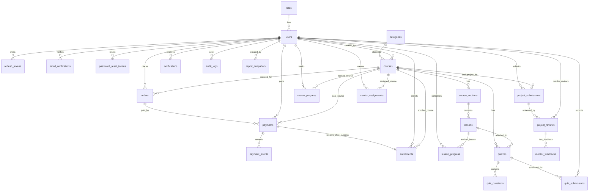

# Tài Liệu Thiết Kế Cơ Sở Dữ Liệu OCP (MySQL + Prisma)

Tài liệu này định nghĩa cấu trúc cơ sở dữ liệu cho hệ thống **Online Course Platform (OCP)**. Cơ sở dữ liệu sử dụng **MySQL** và được truy cập qua **Prisma** trong backend NodeJS/Express-style API.

Mục tiêu thiết kế:

- Hỗ trợ luồng học viên đăng ký, xác thực email, đăng nhập và quản lý hồ sơ.
- Hỗ trợ Guest/Learner xem khóa học, section, lesson và preview content.
- Hỗ trợ thanh toán khóa học trả phí qua VNPAY, lưu lịch sử thanh toán, chống xử lý trùng.
- Hỗ trợ enrollment, course access, learning progress, quiz và final project.
- Hỗ trợ mentor review, admin dashboard/report và notification cơ bản.
- Giữ đúng ranh giới module trong `AGENTS.md`, `PROJECT_AGENTS1.md` và `chia job (1).docx`.

---

## 1. Sơ đồ Quan hệ Thực thể (ERD)



---

## 2. Quy Tắc Thiết Kế Chung

1. **Khóa chính (Primary Key):** Dùng UUID cho tất cả bảng. Với MySQL + Prisma, khuyến nghị lưu dạng `CHAR(36)` qua `String @id @default(uuid()) @db.Char(36)`.
2. **Kiểu dữ liệu tiền tệ:** Dùng `DECIMAL(15,2)` cho giá khóa học, order amount và payment amount. Không dùng `FLOAT/DOUBLE` cho tiền.
3. **Múi giờ:** Lưu thời gian dạng UTC bằng `DATETIME(3)` hoặc `TIMESTAMP(3)` thống nhất trong toàn hệ thống.
4. **Xóa mềm (Soft Delete):**
   - Master data như `users`, `courses`, `categories`, `lessons` dùng `is_active` và/hoặc `deleted_at`.
   - Transaction data như `payments`, `orders`, `enrollments`, `project_submissions` không xóa cứng; dùng `status`.
5. **Ranh giới module:** Module không query trực tiếp bảng do module khác sở hữu. Cross-module data phải đi qua service/contract.
6. **Auth:** JWT lưu trong httpOnly Cookie; database không lưu JWT access token. Nếu dùng refresh flow, chỉ lưu refresh token đã hash.
7. **Payment:** Frontend không quyết định `amount`, `payment_ref`, `status`, `user_id`. Backend snapshot `amount` từ Course Module tại thời điểm tạo payment.
8. **Course access:** Paid course chỉ unlock khi có `enrollment` hợp lệ. Payment `PENDING` không cấp quyền học.
9. **MySQL partial index:** MySQL không hỗ trợ partial unique index kiểu PostgreSQL. Rule "một active PENDING payment cho `user_id + course_id`" phải enforce bằng transaction lock/application lock; generated column chỉ là lựa chọn nâng cao.

---

## 3. Chi Tiết Từng Bảng (25 Bảng, 8 Nhóm)

### 3.1 Nhóm Người Dùng, Auth & Email

#### `roles` (Vai trò)

| Cột | Kiểu | Ghi chú / Ràng buộc |
|:---|:---|:---|
| `id` | CHAR(36) | PRIMARY KEY |
| `code` | VARCHAR(50) | UNIQUE, NOT NULL. Ví dụ: `ADMIN`, `LEARNER`, `MENTOR` |
| `name` | VARCHAR(100) | NOT NULL |
| `permissions` | JSON | Danh sách quyền nếu project cần permission chi tiết |
| `is_active` | BOOLEAN | DEFAULT true, NOT NULL |
| `created_at` | DATETIME(3) | DEFAULT CURRENT_TIMESTAMP(3) |
| `updated_at` | DATETIME(3) | DEFAULT CURRENT_TIMESTAMP(3) |

#### `users` (Người dùng)

| Cột | Kiểu | Ghi chú / Ràng buộc |
|:---|:---|:---|
| `id` | CHAR(36) | PRIMARY KEY |
| `role_id` | CHAR(36) | FOREIGN KEY -> `roles(id)`, NOT NULL |
| `name` | VARCHAR(120) | NOT NULL |
| `email` | VARCHAR(255) | UNIQUE, NOT NULL |
| `phone` | VARCHAR(20) | NULL |
| `avatar_url` | VARCHAR(500) | NULL |
| `bio` | TEXT | NULL |
| `password_hash` | VARCHAR(255) | NOT NULL, không bao giờ trả về frontend |
| `email_verified` | BOOLEAN | DEFAULT false, NOT NULL |
| `status` | VARCHAR(20) | NOT NULL, CHECK IN (`active`, `blocked`, `pending_verification`) |
| `last_login_at` | DATETIME(3) | NULL |
| `created_at` | DATETIME(3) | DEFAULT CURRENT_TIMESTAMP(3) |
| `updated_at` | DATETIME(3) | DEFAULT CURRENT_TIMESTAMP(3) |
| `deleted_at` | DATETIME(3) | NULL, soft delete nếu cần |

#### `refresh_tokens` (Refresh token)

| Cột | Kiểu | Ghi chú / Ràng buộc |
|:---|:---|:---|
| `id` | CHAR(36) | PRIMARY KEY |
| `user_id` | CHAR(36) | FOREIGN KEY -> `users(id)`, NOT NULL |
| `token_hash` | VARCHAR(255) | UNIQUE, NOT NULL; không lưu raw token |
| `expires_at` | DATETIME(3) | NOT NULL |
| `revoked_at` | DATETIME(3) | NULL |
| `created_at` | DATETIME(3) | DEFAULT CURRENT_TIMESTAMP(3) |

#### `email_verifications` (Token xác thực email)

| Cột | Kiểu | Ghi chú / Ràng buộc |
|:---|:---|:---|
| `id` | CHAR(36) | PRIMARY KEY |
| `user_id` | CHAR(36) | FOREIGN KEY -> `users(id)`, NOT NULL |
| `token_hash` | VARCHAR(255) | UNIQUE, NOT NULL |
| `expires_at` | DATETIME(3) | NOT NULL |
| `used_at` | DATETIME(3) | NULL |
| `created_at` | DATETIME(3) | DEFAULT CURRENT_TIMESTAMP(3) |

#### `password_reset_tokens` (Token đặt lại mật khẩu)

| Cột | Kiểu | Ghi chú / Ràng buộc |
|:---|:---|:---|
| `id` | CHAR(36) | PRIMARY KEY |
| `user_id` | CHAR(36) | FOREIGN KEY -> `users(id)`, NOT NULL |
| `token_hash` | VARCHAR(255) | UNIQUE, NOT NULL |
| `expires_at` | DATETIME(3) | NOT NULL |
| `used_at` | DATETIME(3) | NULL |
| `created_at` | DATETIME(3) | DEFAULT CURRENT_TIMESTAMP(3) |

---

### 3.2 Nhóm Course Catalog & Content

#### `categories` (Danh mục khóa học)

| Cột | Kiểu | Ghi chú / Ràng buộc |
|:---|:---|:---|
| `id` | CHAR(36) | PRIMARY KEY |
| `parent_id` | CHAR(36) | FOREIGN KEY -> `categories(id)`, NULL |
| `name` | VARCHAR(120) | NOT NULL |
| `slug` | VARCHAR(160) | UNIQUE, NOT NULL |
| `description` | TEXT | NULL |
| `is_active` | BOOLEAN | DEFAULT true, NOT NULL |
| `created_at` | DATETIME(3) | DEFAULT CURRENT_TIMESTAMP(3) |
| `updated_at` | DATETIME(3) | DEFAULT CURRENT_TIMESTAMP(3) |
| `deleted_at` | DATETIME(3) | NULL |

#### `courses` (Khóa học)

| Cột | Kiểu | Ghi chú / Ràng buộc |
|:---|:---|:---|
| `id` | CHAR(36) | PRIMARY KEY |
| `category_id` | CHAR(36) | FOREIGN KEY -> `categories(id)`, NULL |
| `created_by` | CHAR(36) | FOREIGN KEY -> `users(id)`, NULL |
| `title` | VARCHAR(255) | NOT NULL |
| `slug` | VARCHAR(255) | UNIQUE, NOT NULL |
| `description` | TEXT | NULL |
| `thumbnail_url` | VARCHAR(500) | NULL |
| `level` | VARCHAR(30) | CHECK IN (`beginner`, `intermediate`, `advanced`) |
| `is_paid` | BOOLEAN | DEFAULT false, NOT NULL |
| `price` | DECIMAL(15,2) | DEFAULT 0, NOT NULL |
| `currency` | VARCHAR(10) | DEFAULT `VND`, NOT NULL |
| `status` | VARCHAR(20) | NOT NULL, CHECK IN (`draft`, `active`, `inactive`, `archived`) |
| `published_at` | DATETIME(3) | NULL |
| `created_at` | DATETIME(3) | DEFAULT CURRENT_TIMESTAMP(3) |
| `updated_at` | DATETIME(3) | DEFAULT CURRENT_TIMESTAMP(3) |
| `deleted_at` | DATETIME(3) | NULL |

#### `course_sections` (Section của khóa học)

| Cột | Kiểu | Ghi chú / Ràng buộc |
|:---|:---|:---|
| `id` | CHAR(36) | PRIMARY KEY |
| `course_id` | CHAR(36) | FOREIGN KEY -> `courses(id)`, NOT NULL |
| `title` | VARCHAR(255) | NOT NULL |
| `description` | TEXT | NULL |
| `order_index` | INT | NOT NULL |
| `is_active` | BOOLEAN | DEFAULT true, NOT NULL |
| `created_at` | DATETIME(3) | DEFAULT CURRENT_TIMESTAMP(3) |
| `updated_at` | DATETIME(3) | DEFAULT CURRENT_TIMESTAMP(3) |

#### `lessons` (Bài học)

| Cột | Kiểu | Ghi chú / Ràng buộc |
|:---|:---|:---|
| `id` | CHAR(36) | PRIMARY KEY |
| `section_id` | CHAR(36) | FOREIGN KEY -> `course_sections(id)`, NOT NULL |
| `title` | VARCHAR(255) | NOT NULL |
| `content` | LONGTEXT | NULL; full content chỉ trả nếu có access |
| `video_url` | VARCHAR(500) | NULL |
| `duration_seconds` | INT | DEFAULT 0 |
| `order_index` | INT | NOT NULL |
| `is_preview` | BOOLEAN | DEFAULT false, NOT NULL |
| `is_active` | BOOLEAN | DEFAULT true, NOT NULL |
| `created_at` | DATETIME(3) | DEFAULT CURRENT_TIMESTAMP(3) |
| `updated_at` | DATETIME(3) | DEFAULT CURRENT_TIMESTAMP(3) |
| `deleted_at` | DATETIME(3) | NULL |

---

### 3.3 Nhóm Payment, Order & Enrollment

#### `orders` (Đơn mua khóa học)

| Cột | Kiểu | Ghi chú / Ràng buộc |
|:---|:---|:---|
| `id` | CHAR(36) | PRIMARY KEY |
| `order_number` | VARCHAR(60) | UNIQUE, NOT NULL |
| `user_id` | CHAR(36) | FOREIGN KEY -> `users(id)`, NOT NULL |
| `course_id` | CHAR(36) | FOREIGN KEY -> `courses(id)`, NOT NULL |
| `amount` | DECIMAL(15,2) | NOT NULL, snapshot từ `courses.price` |
| `currency` | VARCHAR(10) | DEFAULT `VND`, NOT NULL |
| `status` | VARCHAR(20) | NOT NULL, CHECK IN (`pending`, `paid`, `failed`, `cancelled`, `expired`) |
| `created_at` | DATETIME(3) | DEFAULT CURRENT_TIMESTAMP(3) |
| `updated_at` | DATETIME(3) | DEFAULT CURRENT_TIMESTAMP(3) |
| `expires_at` | DATETIME(3) | NULL |

#### `payments` (Thanh toán)

| Cột | Kiểu | Ghi chú / Ràng buộc |
|:---|:---|:---|
| `id` | CHAR(36) | PRIMARY KEY |
| `order_id` | CHAR(36) | FOREIGN KEY -> `orders(id)`, NULL trong MVP nếu chưa tạo order riêng |
| `user_id` | CHAR(36) | FOREIGN KEY -> `users(id)`, NOT NULL |
| `course_id` | CHAR(36) | FOREIGN KEY -> `courses(id)`, NOT NULL |
| `payment_ref` | VARCHAR(80) | UNIQUE, NOT NULL; gửi sang VNPAY dưới dạng `vnp_TxnRef` |
| `provider` | VARCHAR(30) | DEFAULT `VNPAY`, NOT NULL |
| `amount` | DECIMAL(15,2) | NOT NULL, snapshot từ course price |
| `currency` | VARCHAR(10) | DEFAULT `VND`, NOT NULL |
| `status` | VARCHAR(20) | NOT NULL, CHECK IN (`PENDING`, `EXPIRED`, `SUCCESS`, `FAILED`, `CANCELLED`) |
| `checkout_url` | TEXT | Full VNPAY signed URL để reuse khi còn active `PENDING` |
| `transaction_id` | VARCHAR(100) | NULL, gateway transaction id sau callback |
| `provider_response_code` | VARCHAR(50) | NULL |
| `provider_payload` | JSON | NULL, sanitized payload; không chứa secret |
| `paid_at` | DATETIME(3) | NULL |
| `expires_at` | DATETIME(3) | NOT NULL |
| `created_at` | DATETIME(3) | DEFAULT CURRENT_TIMESTAMP(3) |
| `updated_at` | DATETIME(3) | DEFAULT CURRENT_TIMESTAMP(3) |

#### `payment_events` (Sự kiện payment/audit payment)

| Cột | Kiểu | Ghi chú / Ràng buộc |
|:---|:---|:---|
| `id` | CHAR(36) | PRIMARY KEY |
| `payment_id` | CHAR(36) | FOREIGN KEY -> `payments(id)`, NOT NULL |
| `event_type` | VARCHAR(50) | NOT NULL. Ví dụ: `CREATED`, `REUSED`, `EXPIRED`, `SUCCESS`, `FAILED` |
| `actor_user_id` | CHAR(36) | FOREIGN KEY -> `users(id)`, NULL |
| `metadata` | JSON | NULL; không chứa VNPAY secret/JWT |
| `created_at` | DATETIME(3) | DEFAULT CURRENT_TIMESTAMP(3) |

#### `enrollments` (Ghi danh khóa học)

| Cột | Kiểu | Ghi chú / Ràng buộc |
|:---|:---|:---|
| `id` | CHAR(36) | PRIMARY KEY |
| `user_id` | CHAR(36) | FOREIGN KEY -> `users(id)`, NOT NULL |
| `course_id` | CHAR(36) | FOREIGN KEY -> `courses(id)`, NOT NULL |
| `payment_id` | CHAR(36) | FOREIGN KEY -> `payments(id)`, NULL với khóa free |
| `source` | VARCHAR(20) | CHECK IN (`free`, `payment`, `admin`) |
| `status` | VARCHAR(20) | NOT NULL, CHECK IN (`active`, `completed`, `cancelled`, `refunded`) |
| `enrolled_at` | DATETIME(3) | DEFAULT CURRENT_TIMESTAMP(3) |
| `completed_at` | DATETIME(3) | NULL |
| `created_at` | DATETIME(3) | DEFAULT CURRENT_TIMESTAMP(3) |
| `updated_at` | DATETIME(3) | DEFAULT CURRENT_TIMESTAMP(3) |
| *Ràng buộc* | | UNIQUE(`user_id`, `course_id`) |

---

### 3.4 Nhóm Learning Progress

#### `lesson_progress` (Tiến độ bài học)

| Cột | Kiểu | Ghi chú / Ràng buộc |
|:---|:---|:---|
| `id` | CHAR(36) | PRIMARY KEY |
| `user_id` | CHAR(36) | FOREIGN KEY -> `users(id)`, NOT NULL |
| `lesson_id` | CHAR(36) | FOREIGN KEY -> `lessons(id)`, NOT NULL |
| `status` | VARCHAR(20) | NOT NULL, CHECK IN (`not_started`, `in_progress`, `completed`) |
| `progress_percent` | DECIMAL(5,2) | DEFAULT 0 |
| `last_position_seconds` | INT | DEFAULT 0 |
| `completed_at` | DATETIME(3) | NULL |
| `created_at` | DATETIME(3) | DEFAULT CURRENT_TIMESTAMP(3) |
| `updated_at` | DATETIME(3) | DEFAULT CURRENT_TIMESTAMP(3) |
| *Ràng buộc* | | UNIQUE(`user_id`, `lesson_id`) |

#### `course_progress` (Tiến độ khóa học)

| Cột | Kiểu | Ghi chú / Ràng buộc |
|:---|:---|:---|
| `id` | CHAR(36) | PRIMARY KEY |
| `user_id` | CHAR(36) | FOREIGN KEY -> `users(id)`, NOT NULL |
| `course_id` | CHAR(36) | FOREIGN KEY -> `courses(id)`, NOT NULL |
| `completed_lessons` | INT | DEFAULT 0 |
| `total_lessons` | INT | DEFAULT 0 |
| `progress_percent` | DECIMAL(5,2) | DEFAULT 0 |
| `status` | VARCHAR(20) | CHECK IN (`not_started`, `in_progress`, `completed`) |
| `last_lesson_id` | CHAR(36) | FOREIGN KEY -> `lessons(id)`, NULL |
| `completed_at` | DATETIME(3) | NULL |
| `created_at` | DATETIME(3) | DEFAULT CURRENT_TIMESTAMP(3) |
| `updated_at` | DATETIME(3) | DEFAULT CURRENT_TIMESTAMP(3) |
| *Ràng buộc* | | UNIQUE(`user_id`, `course_id`) |

---

### 3.5 Nhóm Quiz

#### `quizzes` (Quiz)

| Cột | Kiểu | Ghi chú / Ràng buộc |
|:---|:---|:---|
| `id` | CHAR(36) | PRIMARY KEY |
| `course_id` | CHAR(36) | FOREIGN KEY -> `courses(id)`, NOT NULL |
| `lesson_id` | CHAR(36) | FOREIGN KEY -> `lessons(id)`, NULL |
| `title` | VARCHAR(255) | NOT NULL |
| `description` | TEXT | NULL |
| `time_limit_minutes` | INT | NULL |
| `passing_score` | DECIMAL(5,2) | DEFAULT 0 |
| `status` | VARCHAR(20) | CHECK IN (`draft`, `active`, `inactive`) |
| `created_at` | DATETIME(3) | DEFAULT CURRENT_TIMESTAMP(3) |
| `updated_at` | DATETIME(3) | DEFAULT CURRENT_TIMESTAMP(3) |

#### `quiz_questions` (Câu hỏi quiz)

| Cột | Kiểu | Ghi chú / Ràng buộc |
|:---|:---|:---|
| `id` | CHAR(36) | PRIMARY KEY |
| `quiz_id` | CHAR(36) | FOREIGN KEY -> `quizzes(id)`, NOT NULL |
| `question_text` | TEXT | NOT NULL |
| `question_type` | VARCHAR(30) | CHECK IN (`single_choice`, `multiple_choice`, `true_false`) |
| `options` | JSON | NOT NULL |
| `correct_answer` | JSON | NOT NULL; không trả cho learner trước khi submit |
| `explanation` | TEXT | NULL |
| `points` | DECIMAL(6,2) | DEFAULT 1 |
| `order_index` | INT | NOT NULL |
| `created_at` | DATETIME(3) | DEFAULT CURRENT_TIMESTAMP(3) |

#### `quiz_submissions` (Bài làm quiz)

| Cột | Kiểu | Ghi chú / Ràng buộc |
|:---|:---|:---|
| `id` | CHAR(36) | PRIMARY KEY |
| `quiz_id` | CHAR(36) | FOREIGN KEY -> `quizzes(id)`, NOT NULL |
| `user_id` | CHAR(36) | FOREIGN KEY -> `users(id)`, NOT NULL |
| `answers` | JSON | NOT NULL |
| `score` | DECIMAL(6,2) | DEFAULT 0 |
| `max_score` | DECIMAL(6,2) | DEFAULT 0 |
| `passed` | BOOLEAN | DEFAULT false |
| `started_at` | DATETIME(3) | NULL |
| `submitted_at` | DATETIME(3) | DEFAULT CURRENT_TIMESTAMP(3) |
| `created_at` | DATETIME(3) | DEFAULT CURRENT_TIMESTAMP(3) |

---

### 3.6 Nhóm Final Project & Mentor Review

#### `project_submissions` (Bài nộp final project)

| Cột | Kiểu | Ghi chú / Ràng buộc |
|:---|:---|:---|
| `id` | CHAR(36) | PRIMARY KEY |
| `user_id` | CHAR(36) | FOREIGN KEY -> `users(id)`, NOT NULL |
| `course_id` | CHAR(36) | FOREIGN KEY -> `courses(id)`, NOT NULL |
| `repository_url` | VARCHAR(500) | NULL, link Git repository |
| `demo_url` | VARCHAR(500) | NULL |
| `note` | TEXT | NULL |
| `attempt_no` | INT | DEFAULT 1 |
| `status` | VARCHAR(20) | CHECK IN (`PENDING`, `REVIEWING`, `PASS`, `FAIL`, `CANCELLED`) |
| `submitted_at` | DATETIME(3) | DEFAULT CURRENT_TIMESTAMP(3) |
| `updated_at` | DATETIME(3) | DEFAULT CURRENT_TIMESTAMP(3) |
| *Ràng buộc* | | UNIQUE(`user_id`, `course_id`, `attempt_no`) |

#### `mentor_assignments` (Gán mentor vào course)

| Cột | Kiểu | Ghi chú / Ràng buộc |
|:---|:---|:---|
| `id` | CHAR(36) | PRIMARY KEY |
| `mentor_id` | CHAR(36) | FOREIGN KEY -> `users(id)`, NOT NULL |
| `course_id` | CHAR(36) | FOREIGN KEY -> `courses(id)`, NOT NULL |
| `assigned_by` | CHAR(36) | FOREIGN KEY -> `users(id)`, NOT NULL |
| `status` | VARCHAR(20) | CHECK IN (`active`, `inactive`) |
| `assigned_at` | DATETIME(3) | DEFAULT CURRENT_TIMESTAMP(3) |
| `ended_at` | DATETIME(3) | NULL |
| *Ràng buộc* | | UNIQUE(`mentor_id`, `course_id`) |

#### `project_reviews` (Kết quả chấm final project)

| Cột | Kiểu | Ghi chú / Ràng buộc |
|:---|:---|:---|
| `id` | CHAR(36) | PRIMARY KEY |
| `submission_id` | CHAR(36) | FOREIGN KEY -> `project_submissions(id)`, NOT NULL |
| `mentor_id` | CHAR(36) | FOREIGN KEY -> `users(id)`, NOT NULL |
| `result` | VARCHAR(20) | NOT NULL, CHECK IN (`PASS`, `FAIL`) |
| `score` | DECIMAL(5,2) | NULL |
| `feedback` | TEXT | NULL |
| `reviewed_at` | DATETIME(3) | DEFAULT CURRENT_TIMESTAMP(3) |
| `created_at` | DATETIME(3) | DEFAULT CURRENT_TIMESTAMP(3) |

#### `mentor_feedbacks` (Feedback bổ sung từ mentor)

| Cột | Kiểu | Ghi chú / Ràng buộc |
|:---|:---|:---|
| `id` | CHAR(36) | PRIMARY KEY |
| `review_id` | CHAR(36) | FOREIGN KEY -> `project_reviews(id)`, NOT NULL |
| `mentor_id` | CHAR(36) | FOREIGN KEY -> `users(id)`, NOT NULL |
| `message` | TEXT | NOT NULL |
| `created_at` | DATETIME(3) | DEFAULT CURRENT_TIMESTAMP(3) |

---

### 3.7 Nhóm Notification, Audit & Report

#### `notifications` (Thông báo)

| Cột | Kiểu | Ghi chú / Ràng buộc |
|:---|:---|:---|
| `id` | CHAR(36) | PRIMARY KEY |
| `user_id` | CHAR(36) | FOREIGN KEY -> `users(id)`, NOT NULL |
| `type` | VARCHAR(50) | Ví dụ: `enrollment_success`, `review_result`, `mentor_assigned` |
| `title` | VARCHAR(255) | NOT NULL |
| `message` | TEXT | NOT NULL |
| `priority` | VARCHAR(20) | CHECK IN (`low`, `medium`, `high`) |
| `is_read` | BOOLEAN | DEFAULT false, NOT NULL |
| `read_at` | DATETIME(3) | NULL |
| `reference_type` | VARCHAR(50) | NULL |
| `reference_id` | CHAR(36) | NULL |
| `created_at` | DATETIME(3) | DEFAULT CURRENT_TIMESTAMP(3) |

#### `audit_logs` (Nhật ký hệ thống)

| Cột | Kiểu | Ghi chú / Ràng buộc |
|:---|:---|:---|
| `id` | CHAR(36) | PRIMARY KEY |
| `user_id` | CHAR(36) | FOREIGN KEY -> `users(id)`, NULL nếu system event |
| `action` | VARCHAR(80) | NOT NULL. Ví dụ: `CREATE`, `UPDATE`, `PAYMENT_CALLBACK` |
| `table_name` | VARCHAR(80) | NOT NULL |
| `record_id` | CHAR(36) | NULL |
| `old_data` | JSON | NULL, sanitized |
| `new_data` | JSON | NULL, sanitized |
| `ip_address` | VARCHAR(64) | NULL |
| `user_agent` | VARCHAR(500) | NULL |
| `created_at` | DATETIME(3) | DEFAULT CURRENT_TIMESTAMP(3) |

#### `report_snapshots` (Bản chụp báo cáo, tùy chọn)

| Cột | Kiểu | Ghi chú / Ràng buộc |
|:---|:---|:---|
| `id` | CHAR(36) | PRIMARY KEY |
| `report_type` | VARCHAR(50) | Ví dụ: `revenue`, `course`, `mentor`, `overview` |
| `period_start` | DATE | NULL |
| `period_end` | DATE | NULL |
| `data` | JSON | NOT NULL |
| `created_by` | CHAR(36) | FOREIGN KEY -> `users(id)`, NULL |
| `created_at` | DATETIME(3) | DEFAULT CURRENT_TIMESTAMP(3) |

Ghi chú: Admin report có thể query trực tiếp từ bảng thật qua `reportService/reportRepository`; `report_snapshots` chỉ dùng khi team muốn cache hoặc lưu kết quả báo cáo theo kỳ.

---

### 3.8 Nhóm Bảng Không Bắt Buộc Trong MVP

Các bảng sau **không bắt buộc** trong MVP nhưng có thể thêm ở phase sau nếu spec riêng yêu cầu:

- `certificates`: lưu certificate PDF sau khi hoàn thành course.
- `comments`: Q&A/comment trong lesson.
- `course_reviews`: learner review/rating course.
- `coupons`, `coupon_redemptions`: mã giảm giá; hiện Payment Checkout MVP đã chốt không hỗ trợ coupon/voucher.
- `chat_threads`, `chat_messages`: chat system.

---

## 4. Database Constraints & Rules Enforcement

Các ràng buộc dưới đây nhằm bảo vệ invariant nghiệp vụ ở tầng database. Với MySQL + Prisma, một số rule vẫn cần enforce thêm ở service layer vì MySQL không hỗ trợ partial index theo điều kiện động như `expires_at > NOW()`.

### 4.1 Auth & User Constraints

```sql
ALTER TABLE users
  ADD CONSTRAINT chk_users_status
  CHECK (status IN ('active', 'blocked', 'pending_verification'));
```

```sql
CREATE UNIQUE INDEX idx_users_email ON users (email);
CREATE UNIQUE INDEX idx_roles_code ON roles (code);
```

### 4.2 Course Constraints

```sql
ALTER TABLE courses
  ADD CONSTRAINT chk_courses_price
  CHECK (price >= 0);
```

```sql
ALTER TABLE courses
  ADD CONSTRAINT chk_courses_status
  CHECK (status IN ('draft', 'active', 'inactive', 'archived'));
```

```sql
ALTER TABLE course_sections
  ADD CONSTRAINT uq_course_sections_order
  UNIQUE (course_id, order_index);
```

```sql
ALTER TABLE lessons
  ADD CONSTRAINT uq_lessons_order
  UNIQUE (section_id, order_index);
```

### 4.3 Payment & Enrollment Constraints

```sql
CREATE UNIQUE INDEX idx_payments_payment_ref ON payments (payment_ref);
```

```sql
CREATE UNIQUE INDEX idx_payments_transaction_id ON payments (transaction_id);
```

Ghi chú MySQL: unique index cho phép nhiều giá trị `NULL`, nên nhiều payment chưa có `transaction_id` vẫn hợp lệ. Khi VNPAY callback gán `transaction_id`, DB sẽ chặn trùng transaction id.

```sql
ALTER TABLE enrollments
  ADD CONSTRAINT uq_enrollments_user_course
  UNIQUE (user_id, course_id);
```

```sql
ALTER TABLE payments
  ADD CONSTRAINT chk_payments_status
  CHECK (status IN ('PENDING', 'EXPIRED', 'SUCCESS', 'FAILED', 'CANCELLED'));
```

Rule bắt buộc ở service layer:

- Không tạo hơn một active `PENDING` payment cho cùng `user_id + course_id`.
- Khi checkout lại và pending cũ hết hạn, phải cập nhật pending cũ thành `EXPIRED` trong transaction trước khi tạo payment mới.
- Payment callback phải idempotent theo `payment_ref` và `transaction_id`.
- Tạo `payment SUCCESS -> enrollment CREATED` phải nằm trong cùng transaction.

### 4.4 Learning & Quiz Constraints

```sql
ALTER TABLE lesson_progress
  ADD CONSTRAINT uq_lesson_progress_user_lesson
  UNIQUE (user_id, lesson_id);
```

```sql
ALTER TABLE course_progress
  ADD CONSTRAINT uq_course_progress_user_course
  UNIQUE (user_id, course_id);
```

```sql
ALTER TABLE lesson_progress
  ADD CONSTRAINT chk_lesson_progress_percent
  CHECK (progress_percent >= 0 AND progress_percent <= 100);
```

```sql
ALTER TABLE course_progress
  ADD CONSTRAINT chk_course_progress_percent
  CHECK (progress_percent >= 0 AND progress_percent <= 100);
```

### 4.5 Mentor & Review Constraints

```sql
ALTER TABLE mentor_assignments
  ADD CONSTRAINT uq_mentor_assignments_mentor_course
  UNIQUE (mentor_id, course_id);
```

```sql
ALTER TABLE project_reviews
  ADD CONSTRAINT chk_project_reviews_result
  CHECK (result IN ('PASS', 'FAIL'));
```

Rule bắt buộc ở service layer:

- Mentor chỉ được review submission thuộc course mà mentor đang được assign.
- User có role Mentor chưa đủ; phải có `mentor_assignments.status = 'active'`.
- Khi review PASS/FAIL, cập nhật `project_submissions.status` tương ứng trong transaction.

---

## 5. Tối Ưu Hóa & Chỉ Mục (Indexes)

### 5.1 Auth/User Indexes

```sql
CREATE INDEX idx_users_role_status ON users (role_id, status);
CREATE INDEX idx_refresh_tokens_user ON refresh_tokens (user_id, expires_at);
CREATE INDEX idx_email_verifications_user ON email_verifications (user_id, expires_at);
CREATE INDEX idx_password_reset_tokens_user ON password_reset_tokens (user_id, expires_at);
```

### 5.2 Course Search Indexes

```sql
CREATE INDEX idx_courses_category_status ON courses (category_id, status);
CREATE INDEX idx_courses_paid_price ON courses (is_paid, price);
CREATE INDEX idx_courses_created_at ON courses (created_at DESC);
CREATE INDEX idx_course_sections_course_order ON course_sections (course_id, order_index);
CREATE INDEX idx_lessons_section_order ON lessons (section_id, order_index);
```

Nếu MySQL full-text search được bật:

```sql
CREATE FULLTEXT INDEX idx_courses_search ON courses (title, description);
```

### 5.3 Payment/Enrollment Indexes

```sql
CREATE INDEX idx_payments_user_course_status ON payments (user_id, course_id, status);
CREATE INDEX idx_payments_status_expires ON payments (status, expires_at);
CREATE INDEX idx_payments_created_at ON payments (created_at DESC);
CREATE INDEX idx_orders_user_status ON orders (user_id, status);
CREATE INDEX idx_enrollments_user_status ON enrollments (user_id, status);
CREATE INDEX idx_enrollments_course_status ON enrollments (course_id, status);
CREATE INDEX idx_payment_events_payment_time ON payment_events (payment_id, created_at DESC);
```

### 5.4 Learning/Quiz Indexes

```sql
CREATE INDEX idx_lesson_progress_user_status ON lesson_progress (user_id, status);
CREATE INDEX idx_course_progress_user_status ON course_progress (user_id, status);
CREATE INDEX idx_quizzes_course_status ON quizzes (course_id, status);
CREATE INDEX idx_quiz_submissions_user_quiz ON quiz_submissions (user_id, quiz_id, submitted_at DESC);
```

### 5.5 Project/Mentor/Admin Indexes

```sql
CREATE INDEX idx_project_submissions_course_status ON project_submissions (course_id, status);
CREATE INDEX idx_project_submissions_user_course ON project_submissions (user_id, course_id);
CREATE INDEX idx_mentor_assignments_mentor_status ON mentor_assignments (mentor_id, status);
CREATE INDEX idx_project_reviews_submission ON project_reviews (submission_id);
CREATE INDEX idx_notifications_user_unread ON notifications (user_id, is_read, created_at DESC);
CREATE INDEX idx_audit_logs_record ON audit_logs (table_name, record_id);
CREATE INDEX idx_audit_logs_time ON audit_logs (created_at DESC);
```

---

## 6. Ghi Chú Triển Khai Với Prisma

1. Prisma schema nên dùng `Decimal` cho `price`, `amount`, `score`, `progress_percent`.
2. Với MySQL, UUID có thể lưu bằng `String @db.Char(36)` để dễ debug trong đồ án.
3. Không tự viết raw SQL trong service. Nếu cần `SELECT ... FOR UPDATE` cho payment race condition, chỉ đặt trong repository và ghi rõ lý do.
4. Migration cũ không được sửa/xóa sau khi đã apply vào database chung.
5. `provider_payload`, `metadata`, `permissions`, `answers`, `options`, `correct_answer`, `data` dùng JSON nhưng phải sanitize trước khi lưu.
6. Không lưu secret VNPAY, JWT, password plain text, raw reset token hoặc raw verification token vào DB.
7. Các bảng `payment_events`, `audit_logs`, `notifications`, `report_snapshots` có thể triển khai sau nếu MVP muốn giảm scope, nhưng `payments` và `enrollments` là bắt buộc cho paid course access.
